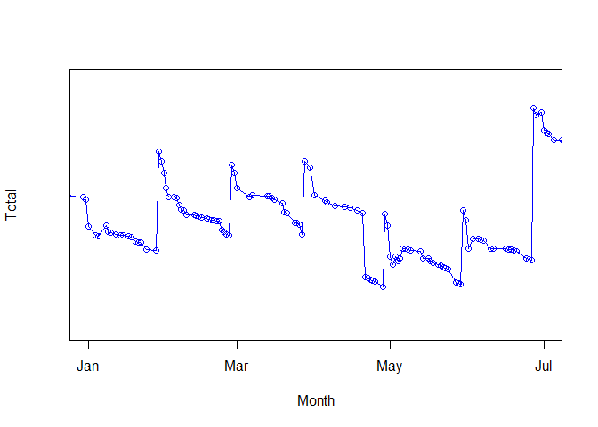
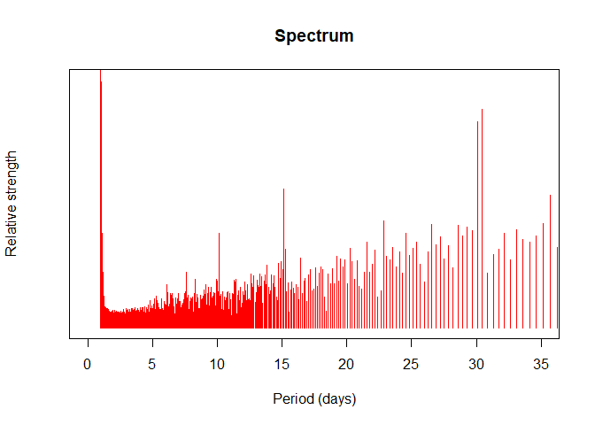

Title: The spectrum of my personal accountancy
Date: 11/28/2018, 1:54:29 PM
Category: Blog
Lang: en
Tags: math, R
Slug: spectrum-accountancy
Authors: Pablo Rodríguez-Sánchez
Summary: Application of Fourier analysis to a personal accountancy timeseries
Comments: True

<script src='https://cdnjs.cloudflare.com/ajax/libs/mathjax/2.7.5/MathJax.js?config=TeX-MML-AM_CHTML' async></script>

Since year 2012, I keep and maintain a *.csv* file containing
information about my bank accounts. The most relevant data is the time
series of the total amount of money vs. date. The table below shows a
small subset of this data:

<table>
<thead>
<tr class="header">
<th align="left">Date</th>
<th align="right">Total</th>
</tr>
</thead>
<tbody>
<tr class="odd">
<td align="left">2012-09-26</td>
<td align="right">641.52</td>
</tr>
<tr class="even">
<td align="left">2012-09-24</td>
<td align="right">703.52</td>
</tr>
<tr class="odd">
<td align="left">2012-09-22</td>
<td align="right">723.52</td>
</tr>
<tr class="even">
<td align="left">2012-09-19</td>
<td align="right">755.52</td>
</tr>
<tr class="odd">
<td align="left">2012-09-18</td>
<td align="right">765.52</td>
</tr>
</tbody>
</table>

When plotted, the data looks as noisy as the example on the figure below. The most noticeable regularity is the periodic increment at the end of each month, corresponding with the **pay day**... followed by a big expenditure corresponding to paying the **rent**. Notice also the higher pay in late June, corresponding to the summer extra salary that is customarily applied in several countries. The timeseries looks irregular, but there is some clear periodical component on it.



I know that the Fourier transform of a continuous timeseries is the perfect tool for spotting underlying periodicities. But my timeseries is uneven and discontinous. How can we fix this?

## First step: Interpolation
The first problem, unevenness of data, can be solved by good old interpolation methods. The only tricky part here is that our *x* coordinates are dates, so it is advisable to use *lubridate*.

I used the following:

```
library(dplyr)
library(lubridate)

first_day <- min(df$Date)
last_day <- max(df$Date)

# Add a column with relative day as an integer
df <- mutate(df, Day_index = as.numeric(df$Date - first_day))

# Create the time vector used for interpolation
all_days <- seq(first_day, last_day, by = 1)
all_indices <- seq(1, length(all_days), by = 1)

daily_total <- approx(x = df$Day_index, y = df$Total, xout = all_indices, yright = head(df$Total, 1))
```

## Second step: Fourier transform
For discrete, evenly spaced timeseries as the one we have after interpolation, fast Fourier transform can be used to estimate dominant frequencies. The fast Fourier transform or *FFT* is defined as a function of an integer parameter *k* and a set of *N* complex numbers {*x*<sub>0</sub>, *x*<sub>1</sub>, ...*x*<sub>*N* − 1</sub>}.

The definition goes as follows:

$$
X\_k = FFT \[ k; \\lbrace x\_n \\rbrace\] \\equiv  \\sum\_{n=0}^{N-1} x\_n\\cdot e^{-i 2 \\pi k \\frac{n}{N}}
$$

and the inverse:

$$
x\_n = FFT^{-1} \[ n; \\lbrace X\_k \\rbrace\] \\equiv  \\frac{1}{N}\\sum\_{k=0}^{N-1} X\_k \\cdot  e^{i 2 \\pi k \\frac{n}{N}}
$$

The *FFT* can be used to estimate the spectrum of a signal. While doing this, it is important to note that *n* and *k* are unit-less vector indices. In order to link those indices with physical quantities as time and frequency, we could notice that:

$$
x_n = x(n \cdot \Delta t) \equiv x(t_n)
$$

where *Δ**t* is the sampling period. If we take a number *N* of samples, the final sample time should be:

$$
t_{end} = N \cdot \Delta t \equiv t_N
$$

Going to our first equation with all this in mind, we have:

$$
X\_k \\equiv \\\\
\\sum\_{n=0}^{N-1} x\_n \\cdot e^{-i 2 \\pi k \\frac{n}{N}} = \\\\
\\sum\_{n=0}^{N-1} x(n \\cdot \\Delta t) \\cdot e^{-i 2 \\pi k \\frac{n \\cdot \\Delta t}{t\_{end}}} = \\\\
\\sum\_{t\_n=0}^{t\_{end}-\\Delta t} x(t\_n) \\cdot e^{-i 2 \\pi k \\frac{t\_n}{t\_{end}}} = \\\\
\\sum\_{t\_n=0}^{t\_{end}-\\Delta t} x(t\_n) \\cdot e^{-i \\frac{2 \\pi k}{t\_{end}} t\_n} = \\\\
\\sum\_{t\_n=0}^{t\_{end}-\\Delta t} x(t\_n) \\cdot e^{-i \\omega\_k t\_n}
$$

so, the link between the indices *k* and the corresponding physical frequencies *ω*<sub>*k*</sub> is given by:

$$
\\omega\_k = \\frac{2 \\pi}{t\_{end}} k
$$

We just added units (and thus, physical) significance to the indexes *k* and *n*!

The (quite primitive) code I used for doing this is:

```
    fft_spectrum <- function(ts, ys, as.freq = TRUE) {
      # Translate k indices into frequencies
      tEnd <- tail(ts, 1)
      fs <- seq(0, length(ys)-1) / tEnd # In T^-1 units (typically Hz, if the time is in seconds)

      #Perform fast Fourier transform
      Xk <- Mod(fft(ys))

      if(as.freq) { # Use frequencies
        list(f = fs, Xk = Xk)
      } else { # Use periods
        list(T = 1/fs, Xk = Xk)
      }
    }
```

## Results
After applying the two algorithms described above I find the following distribution of the relative lengths of each period:



Note that the strengths corresponding to periods of *30* and *31* days are higher than their neighbors, corresponding to pay-days and monthly payments. Even my very basic algorithm could see it!

*PS: I removed several details, plus trimmed both vertical and horizontal scales. I did this in order to keep my privacy. After all, the FFT is an invertible operation!*

This entry appears in [R-bloggers.com](https://www.r-bloggers.com) 
