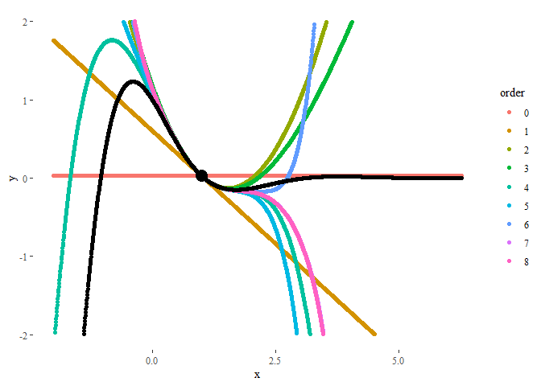
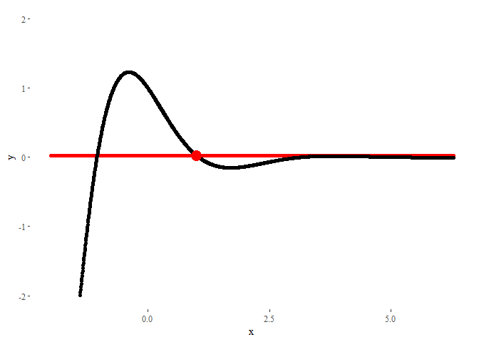

Title: Animations in R
Date: 12/2/2018, 2:22:33 PM
Category: Blog
Lang: en
Tags: math, R
Slug: animations-r
Authors: Pablo Rodríguez-Sánchez
Summary: How to make animations in R using ggplot2 and gganimate
Comments: True

<script src='https://cdnjs.cloudflare.com/ajax/libs/mathjax/2.7.5/MathJax.js?config=TeX-MML-AM_CHTML' async></script>

I've recently discovered the package *gganimate* thanks to this
[brilliant
example](http://blog.schochastics.net/post/beautiful-chaos-the-double-pendulum/).
I've been playing with the package during this weekend, and I created
some examples that I spread through
[Twitter](https://twitter.com/DonMostrenco/status/1068791278173908992).

Some Twitter users showed interest in knowing more. I hope this short
tutorial can satisfy them.

Libraries used
--------------

We're going to need the following libraries:

```
    # Numerical
    library(pracma) # To calculate the Taylor polynomials
    library(reshape) # For using melt

    # Display
    library(ggplot2) # For plotting
    library(ggthemes) # Also for plotting
    library(gganimate) # For animating. Install using devtools::install_github('thomasp85/gganimate')
    library(kableExtra) # To display nice tables
```

Animating a moving particle
---------------------------

Here we'll generate a moving particle. First, we need the positions in
time. In our case, the dynamical equations will be given by:

$$ \\begin{cases} x(t) = cos(t) \\\\ y(t) = sin(2t) \\end{cases}$$

So we generate the series and store them in a dataframe:

```
    ts <- seq(0, 2*pi, length.out = 100)
    xs <- cos(ts)
    ys <- sin(2*ts)

    particle <- data.frame(ts = ts, xs = xs, ys = ys)
```

The code for generating the animation follows a very similar syntax to
*ggplot*. In this case, we indicate that the values of *ts* should be
used as the transition time.

```
    ggplot(data = particle) +
      geom_point(aes(x = xs, y = ys), col = 'red') + # Generate the plot
      theme_tufte() + # Make ...
      labs(x = 'x', y = 'y') + # ... it ...
      scale_y_continuous(limits = c(-2, 2)) + # ... look ...
      guides(col = FALSE) + # ... pretty.
      transition_time(ts) + # And animate!
      ease_aes('linear')
```


Animating a Taylor series
-------------------------

Let's see now a more complex example. Our purpose is to explore Taylor
polynomials of different degrees approximating the function

$$f(x) = cos(\\frac{3x}{2}) e^{-x} $$

around a given point.

Thus, we begin creating the function:
```
    f <- function(x) {
      cos(1.5*x)*exp(-x)
    }
```
In this case, we want to compare how good is the performance of Taylor
polynomials of different orders. The data we have to generate is a bit
more complex than before.
```
    xs <- seq(-2, 2*pi, length.out = 1500) # Values of x
    x0 <- 1 # Value of x where the Taylor series will be centered
    ys <- matrix(0, nrow = length(xs), ncol = 9)
    for(i in 1:9) { # Extract Taylor polynomials of orders 0 to 8
      order <- i - 1 # Indexes have to be positive, but first order is 0
      if(order == 0) { # A Taylor polynomial of order zero is just...
        ys[,i] <- f(x0) # ... a constant function
      } else {
        taylor_coefs <- taylor(f = f, x0 = x0, n = order) # Get polynomial
        ys[,i] <- polyval(taylor_coefs, xs) # Evaluate polynomial
      }
    }

    # Rewrite as dataframe
    df <- data.frame(ys)
    colnames(df) <- seq(0,8)
    df <- melt(df)
    df <- cbind(df, xs = rep(xs,9), f = f(xs))
    colnames(df) <- c('order', 'ys', 'xs', 'f')
```

The resulting dataframe is a collection of polynomials of different
orders evaluated at each point in *xs*. Additionally, we added the
values of the original function *f(x)*, also at each point:

<table>
<thead>
<tr class="header">
<th align="left">order</th>
<th align="right">ys</th>
<th align="right">xs</th>
<th align="right">f</th>
</tr>
</thead>
<tbody>
<tr class="odd">
<td align="left">0</td>
<td align="right">0.0260228</td>
<td align="right">-2.000000</td>
<td align="right">-7.315110</td>
</tr>
<tr class="even">
<td align="left">0</td>
<td align="right">0.0260228</td>
<td align="right">-1.994474</td>
<td align="right">-7.265955</td>
</tr>
<tr class="odd">
<td align="left">0</td>
<td align="right">0.0260228</td>
<td align="right">-1.988948</td>
<td align="right">-7.216622</td>
</tr>
<tr class="even">
<td align="left">0</td>
<td align="right">0.0260228</td>
<td align="right">-1.983423</td>
<td align="right">-7.167120</td>
</tr>
<tr class="odd">
<td align="left">0</td>
<td align="right">0.0260228</td>
<td align="right">-1.977897</td>
<td align="right">-7.117454</td>
</tr>
<tr class="even">
<td align="left">0</td>
<td align="right">0.0260228</td>
<td align="right">-1.972371</td>
<td align="right">-7.067632</td>
</tr>
</tbody>
</table>

A static plot will look like:
```
    ggplot(data = df) +
      geom_point(aes(x = xs, y = ys, col = order)) + # Generate basic plot
      geom_point(aes(x = xs, y = f)) + # Plot also original function
      geom_point(aes(x = x0, y = f(x0)), col = 'black', size = 5) + # Remark initial point
      theme_tufte() + # Make it ...
      labs(x = 'x', y = 'y') + # ... look ...
      scale_y_continuous(limits = c(-2, 2)) # ... pretty.
```


In order to animate it, now we will use the command
*transition\_states*, using *order* (the order of the Taylor polynomial)
as the animation parameter. The parameters *transition\_length* and
*state\_length* control how much time each state stays in screen, and
how long the transition between states should look.
```
    ggplot(data = df) +
      geom_point(aes(x = xs, y = ys), col = 'red') + # Add basic plot
      geom_point(aes(x = xs, y = f)) + # Plot also original function
      geom_point(aes(x = x0, y = f(x0)), col = 'red', size = 5) + # Remark initial point
      theme_tufte() + # Make ...
      labs(x = 'x', y = 'y') + # ... it ...
      scale_y_continuous(limits = c(-2, 2)) + # ... look ...
      guides(col = FALSE) + # ... pretty.
      transition_states(order, transition_length = 1, state_length = 0.5) + # And animate!
      ease_aes('linear')
```


The result could not look nicer!

PS: If you liked this post, [this
visualization](https://www.geogebra.org/m/CeW2gCzH) I made in *GeoGebra*
some time ago may also be of your interest.
