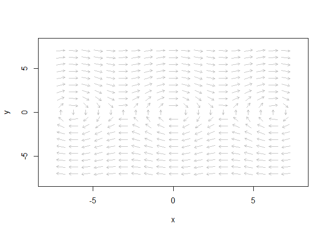
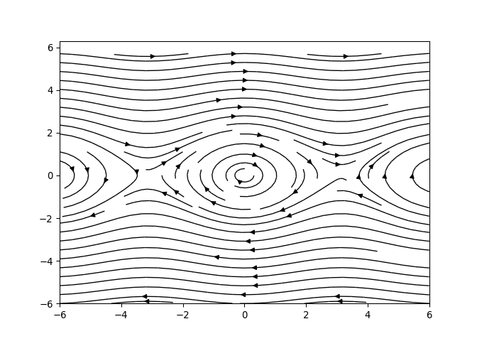

Title: Python or R? Why not both?
Date: 3/22/2019, 10:50:31 AM
Category: Blog
Lang: en
Tags: math, R, Python
Slug: PyR
Authors: Pablo Rodríguez-Sánchez
Summary: How to use Python code inside R
Comments: True

<script src='https://cdnjs.cloudflare.com/ajax/libs/mathjax/2.7.5/MathJax.js?config=TeX-MML-AM_CHTML' async></script>

*Python* and *R*. They are two of the most popular programming languages
for science. They are both free, both of them have a strong user
community and both of them work pretty well.

Personally, I find *Python* way more intuitive than *R* (at least for
people who, like me, have a classical mathematics background). Thinking
in terms of data frames is great when you work with statistical data,
but it gets a bit annoying when you are more interested in analysis. To
uneven the score even more, *Python's* libraries like *NumPy*, *SciPy*,
*SimPy* and *Matplotlib* are the perfect toolbox for anyone doing
mathematical research of any kind.

But... I chose *R*. Why?

There is only one reason for doing so: *knitr*[1]. *knitr* is a package
that turns a combination of text **and code** (the *RMarkdown* file)
into almost any format of human readable text, including a *pdf* report,
slides, or a blog page like [the one you are reading now](https://github.com/PabRod/pabrod.github.io-src/blob/master/auxs/Rmd/2019-03-22%20PyR.Rmd). The interesting
point is the integration of the code with the text. This means that an
*RMarkdown* document is not passive. This allows one to write papers
that, quite literally, recalculate themselves any time needed. *knitr*,
combined with research code structured as an *R* package, is clearly my
favourite way of writing research. The package structure keeps my code
tidy and tested, and *knitr* allows me to do all and the figures the
writing in a single file. The result is a rock-solid, reproducible
output. Let me put it like this: *knitr* is like *LaTeX* on steroids![2]

But... I keep finding *R* annoying. A few days ago, after looking for
hours for a nice way of ploting phase planes, I gave up. All the
possibilities I found were terribly ugly. I had to go back to *Python's*
*Matplotlib* and its function *streamplot*. See for yourself:

With *R*:



With *Python*:



After a bit of googling, I found an *R* library called *reticulate* that
allows to run *Python* code from inside *R*. If this works (I thought) I
can keep the best of both approaches! And, so far, it works flawlessly!

How to do it
------------

First of all, *R* and *Python* are obviously reequired. *reticulate* can
be installed and loaded as usual in *R*:

    install.packages("reticulate")
    library(reticulate)

For [some
reason](https://community.rstudio.com/t/matplotlib-inline-plots-with-reticulate-on-rstudio-server/16357)
I still don't fully understand, I had to add these two lines to make
*Matplotlib* work properly.

    matplotlib <- import("matplotlib", convert = TRUE)
    matplotlib$use("Agg")

Now, we can insert python chunks in *Rmarkdown*:

    ```{python, eval=TRUE}
    import numpy as np
    x = np.pi
    y = np.sin(x/4)
    print(y)
    ```

    ## 0.707106781187

Interaction
-----------

*reticulate* works creating two different sessions, one of *R* and
another of *Python*. In order to unleash all the power of this
combination, we need a way of passing variables between both sessions.
This is done via the dataframe `py`. See examples below:

### From *R* to *Python*

Create a variable and store it as a field of `py`:

    ```{r}
    py$foo <- "Hi!"
    ```

The variable will be available in the *Python* session:

    ```{python}
    print(foo)
    ```

    ## Hi!

### From *Python* to *R*

Create a variable inside the *Python* session:

    ```{python}
    bar = "How are you?"
    ```

The variable will be available as a field of the dataframe `py` in the
*R* session:

    ```{r}
    py$bar
    ```

    ## [1] "How are you?"

This entry appears in [R-bloggers.com](https://www.r-bloggers.com) 

[1] Actually, there is a second (and less important) reason: *Shiny*.

[2] It is true that *Python* also has *Jupyter* for reproducible
research, but the results are just not as neat as with *R*.
