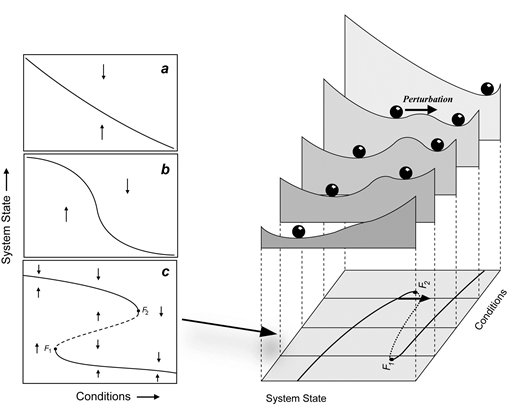

Title: Preprint: Climbing Escher's ladder
Date: 4/19/2019, 9:50:08 AM
Category: Blog
Lang: en
Tags: announcement
Slug: quasipotentials
Authors: Pablo Rodríguez-Sánchez
Summary: Announcement of the preprint of my second paper
Comments: True

Contrary to the popular opinion, biological models are harder than physical ones. The latter tend to be linear, have conserved quantities, hamiltonians, and that kind of nice features. One of this nice features I particularly miss is scalar potentials. And apparently biologists miss them too.

Potentials are often used in biology (often referred to as stability landscapes or ball-in-a-cup diagrams) as visual analogies to understand the properties of dynamical systems. Those diagrams have proven to be particularly useful to communicate complicated concepts from dynamical systems theory to non-expert audiences, such as bifurcation, basin of attraction or hysteresis. Unfortunately, when we try to use these pictures for multidimensional systems we find a subtle, albeit critical limitation: unless very restrictive conditions are met, potentials fail to exist.

Our first challenge was to address the subtle reason a potential may fail to exist without using heavy mathematical weaponry. We found a surprisingly accurate analogy in the world of art, particularly in M.C. Escher's paintings of impossible objects. The second challenge was to provide, at least, a partial solution to the problem. We introduced a simple and efficient algorithm that takes into account the abovementioned limitations, providing the best quasi-potential candidate plus an error map indicating the regions of the phase space where it is safe to use it.

The title of this preprint is [_Climbing Escher's stairs: a way to approximate stability landscapes in multidimensional systems_](https://arxiv.org/abs/1903.05615). The document is freely available in [arXiv](https://arxiv.org/abs/1903.05615).

Together with the article, and fueling my personal obsession with collaboration and reproducibility, I wrote and published an R package called [rolldown](https://github.com/PabRod/rolldown) (my first one!) implementing the described algorithm.

## Abstract
Stability landscapes are useful for understanding the properties of dynamical systems. These landscapes can be calculated from the system's dynamical equations using the physical concept of scalar potential. Unfortunately, for most biological systems with two or more state variables such potentials do not exist. Here we use an analogy with art to provide an accessible explanation of why this happens. Additionally, we introduce a numerical method for decomposing differential equations into two terms: the gradient term that has an associated potential, and the non-gradient term that lacks it. In regions of the state space where the magnitude of the non-gradient term is small compared to the gradient part, we use the gradient term to approximate  the potential as quasi-potential. The non-gradient to gradient ratio can be used to estimate the local error introduced by our approximation. Both the algorithm and a ready-to-use implementation in the form of an R package are provided.

## Authors
- [Pablo Rodríguez-Sánchez](http://www.sparcs-center.org/about-us/staff-contacts/pablo-rodriguez.html)
- [Egbert H. van Nes](http://www.sparcs-center.org/about-us/staff-contacts/egbert-van-nes.html)
- [Marten Scheffer](http://www.sparcs-center.org/about-us/staff-contacts/marten-scheffer.html)

All from Wageningen University and Research.
