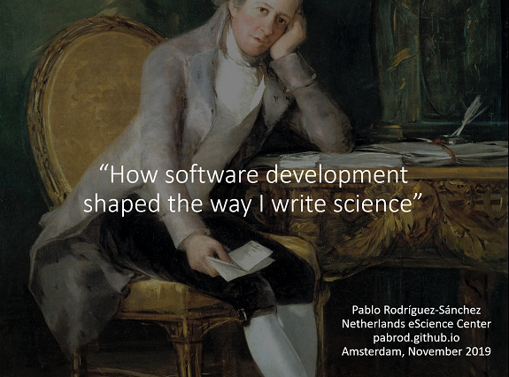

Title: Talk announcement: How software development shaped the way I write science (National eScience Symposium)
Date: 11/17/2019, 4:28:38 PM
Category: Blog
Lang: en
Tags: announcement
Slug: NLeSC_symp19
Authors: Pablo Rodríguez-Sánchez
Summary: How software development shaped the way I write science, 21 November 2019, National eScience Symposium 2019. Amsterdam
Comments: True

A few months ago, I informally presented an earlier version of this talk at the [Netherlands eScience Center](https://www.esciencecenter.nl/) (NLeSC). Two remarkable things happened after that:

1. Now I am an _eScience Engineer_ at NLeSC.
2. They invited me to give the talk again. This time in a less informal setting: the [National eScience Symposium](https://www.esciencesymposium2019.nl), and in a less informal venue: the Ajax stadium

## Title
How software development shaped the way I write science

##  Abstract
When we say that scientific papers are complex, we tend to think that their contents are complex. While this is true, there is much more: a paper itself is a complex form of communication. In this short talk I'll explain how my years in the industry of software development dramatically changed the way I write scientific publications.

## Spacetime coordinates
* 21 November. Johan Cruijff Arena, Amsterdam. [FAIR software session](https://www.esciencesymposium2019.nl/page/608898). Registration required

## Links
- Slides temporarily available [here](https://www.dropbox.com/s/lhh00gunxgmeu2q/Talk%20at%20Johan%20Cruijff%20-%20public.pptx?dl=0)

## Key references
1. My research workflow, based on GitHub. Carl Boettiger. Available [here](https://www.carlboettiger.info/2012/05/06/research-workflow.html)
2. Wilson G, Aruliah DA, Brown CT, Chue Hong NP, Davis M, Guy RT, et al. Best Practices for Scientific Computing. Eisen JA, editor. PLoS Biol [Internet]. 2014 Jan 7. Available [here](http://journals.plos.org/plosbiology/article?id=10.1371/journal.pbio.1001745)
3. Galileo's instruments of credit. Telescopes, images, secrecy. Mario Biagioli.
4. Rodríguez-Sánchez P. PabRod/rolldown. 2019. Available from: [https://doi.org/10.5281/zenodo.2591550](https://doi.org/10.5281/zenodo.2591550)
5. Rodríguez-Sánchez P, van Nes EH, Scheffer M. Climbing Escher’s stairs: a simple quasi-potential algorithm for weakly non-gradient systems. 2019 Mar 13. Available from: [http://arxiv.org/abs/1903.05615](http://arxiv.org/abs/1903.05615)
