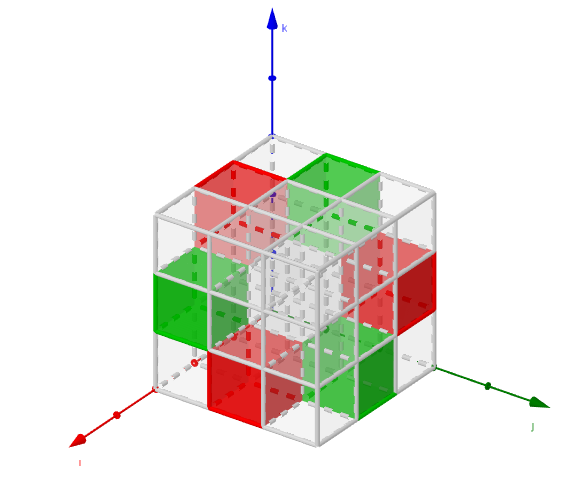

Title: Visualization of a 3D Levi-Civita symbol
Date: 12/8/2019, 4:37:24 PM
Category: Blog
Lang: en
Tags: math, GeoGebra
Slug: levi-civita
Authors: Pablo Rodríguez-Sánchez
Summary: Simple way of visualizing the structure of the Levi-Civita symbol
Comments: True

The [Levi-Civita symbol](https://en.wikipedia.org/wiki/Levi-Civita_symbol) is that puzzling $\epsilon_{ijk}$ term that appears in the calculation of determinants and vector products. It has, thus, lots of applications in algebra, geometry, mechanics, electromagnetism, ... A (boring) definition is given in the textbox below.

---

The value of $\epsilon_{ijk}$ goes as follows:

It is $0$ if the value of **any** index is repeated, such as in $ijk = 112$

It is $1$ if the indices are $ijk \in123, 312, 231$

It is $-1$ if the indices are $ijk \in 321, 132, 213$

---

I am interested in visualization. Unfortunately, the Levi-Civita symbol has three indices, $i$, $j$ and $k$, so we cannot represent it as a matrix or a vector. But, taking advantage of its discrete nature (it can only take 3 different values) we can create a "cubic matrix" to visualize it. This matrix contains $3 \times 3 \times 3$ cubes, each of them univocally identified by a triplet $ijk$, and the color tells us its value (grey for $0$, green for $1$, red for $-1$).

That's what I did in a GeoGebra applet. I leave it here, just in case anyone finds it interesting. Click on the image to open an interactive version where the cube can be rotated.

