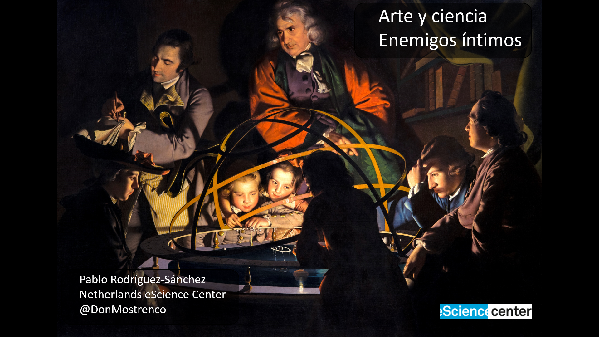

Title: Talk announcement: Ciencia y arte, enemigos íntimos (Festival Arte y Ciencia)
Date: 3/9/2020, 10:25:40 AM
Category: Blog
Lang: en
Tags: announcement
Slug: arte_y_ciencia
Authors: Pablo Rodríguez-Sánchez
Summary: Science and arts are often presented as opposite to each other, but are they? 10-11 March 2020, Planetario de Pamplona, Navarre, Spain.
Comments: True

## Title
Arte y ciencia, enemigos íntimos

This talk will be given in Spanish.

##  Abstract
Science and arts are often presented as opposite to each other, but are they?

This talk will be part of the [Festival arte y ciencia](https://www.unavarra.es/unidadculturacientifica/ciclo-arte-ciencia-y-tecnologia?opcion=1).

## Spacetime coordinates
* 10-11 March. [Planetario de Pamplona](https://www.pamplonetario.org/), Navarra, Spain. Free access
