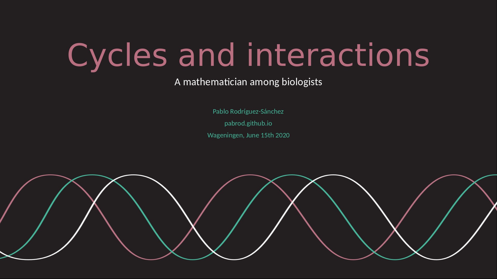

Title: Talk announcement: Thesis defense
Date: 6/8/2020, 4:22:24 PM
Category: Blog
Lang: en
Tags: announcement
Slug: defense
Authors: Pablo Rodríguez-Sánchez
Summary: The day finally arrived!
Comments: True

## Invitation
I am happy to inform you that next week I'll be publicly defending my PhD thesis entitled:

_Cycles and interactions: a mathematician among biologists_

The defense will be conducted in English language.

## Spacetime coordinates
* 15 June 2020, 13:30 CEST. The ceremony will take place exclusivelly [online](https://weblectures.wur.nl/P2G/Player/Player.aspx?id=C217).

##  Abstract
The backbone of this thesis is the interdisciplinary interaction between dynamic systems theory and a selection of biological problems. Each chapter focuses in one problem, namely plankton dynamics, cell development paths and sleep-wake dynamics. Despite these topics may seem disconnected, they share an important feature: all of them show cyclic behaviour under certain circumstances.

In the present thesis we show that cyclic (or chaotic) behaviour is deeply related with plankton biodiversity. We also use cycles to show, in an intuitive way, that Waddington’s epigenetic landscapes (a common visual tool in stem cell research) are poorly defined, and we provide a practical solution to this. Lastly, we provide an algorithm to forecast a transition between synchronized and non-synchronized cyclic systems (such as normal sleep – insomnia, or normal hearth functioning – arrhythmia), with potential applications in medical sciences.

The thesis is temporarily available [here](https://www.dropbox.com/sh/kg147e5x0o09ddl/AABvsbPApgMXJhBSQNnfqa1Ja?dl=0).
