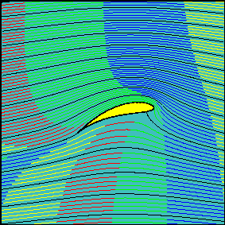

Title: Talk announcement: Complex numbers for research software engineers
Date: 10/12/2020, 9:07:06 AM
Category: Blog
Lang: en
Tags: announcement
Slug: complex-sig
Authors: Pablo Rodríguez-Sánchez
Summary: A talk about applications of complex numbers in computational sciences
Comments: True

## Title
_Complex numbers for research software engineers_

##  Abstract
If you are reading this, most likely you are working on a computer-science related field.
Why would you care about the square root of minus one (also known as i)? Let me give you a few reasons:

The mysterious number i:

* is the NaN of the Renaissance.
* appears in the Euler's identity, acclaimed as the most beautiful equation ever.
* allowed for difficult computations in aerodynamics before the computer was invented.
* can improve your numerical differentiation algorithms with minimal effort.

The slides are temporarily available [here](https://www.dropbox.com/s/18dmbov56d5vfm2/Complex%20numbers.pptx?dl=0).

## Spacetime coordinates
* 12 October 2020, 11:00 CEST. Online, for eScience Center members only.

