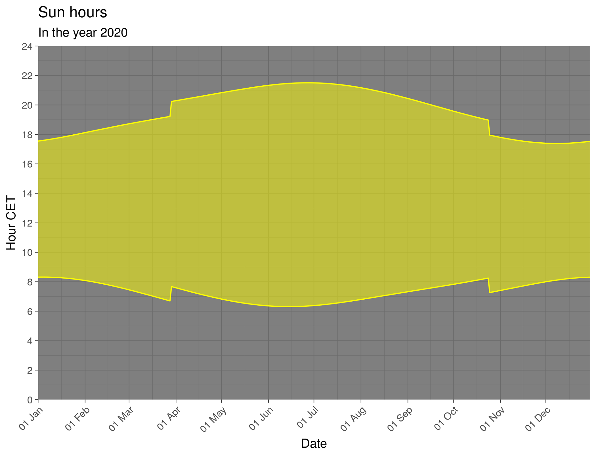

Title: Daylight charts with R
Date: 10/24/2020, 11:17:17 AM
Category: Blog
Lang: en
Tags: math, R
Slug: clock
Authors: Pablo Rodríguez-Sánchez
Summary: This weekend most of Europe says goodbye to summertime. Visualize the consequences using R.
Comments: True

It happens every year. Twice. And it can be pretty annoying. I am talking about the clock shift to re-adapt our schedules to wintertime or summertime. But did you know that this October 25 may be the last time this happens? Well… at least if you are reading these lines from Europe.

But, why do we do it? Changing the clocks reduces the undesirable effects of an astronomical phenomenon: that of the variability of sunlight hours during the year. To make it even more difficult, this variability depends not only on the day of the year but also on the location on Earth.

Luckily, the study of the relationship between daylight duration, position, and date is one of the oldest objects of study. There are some early references in the Babylonian time, the topic was already covered in Ptolemy’s _Almagest_, and it is part of the everyday life of sailors since, at least, the publication of the first nautical almanacs in the 1700s.

We can summarize all we need in charts like this:

The figure above is a daylight chart corresponding to the city of Barcelona, Spain, in the year 2020. The abrupt changes correspond with the spring and autumn clock shifts. Notice how the clock shift keeps the sunrise around 8:00 AM.

I've generated the chart in *R*. Nowadays, quick and simple access to astronomical and geographical databases makes it easier than ever to simulate daylight charts at any point in the world. In particular, I wrote [this code in R](https://github.com/PabRod/daylight-charts) to generate such diagrams. It relies on the CRAN packages:

- `maps`: for converting the name of a city into its geographical coordinates.
- `lutz`: for extracting the official timezone from the coordinates.
- `suncalc`: for deriving the sunset and sunrise times at the selected location.

It can be run as an interactive applet, either in [Shinyapps](https://pabrod.shinyapps.io/cambio-de-hora/) or [locally](https://github.com/PabRod/daylight-charts), to query for any city in the EU with a population over 100k. Additionally, I precalculated a collection of daylight charts for [Dutch](https://github.com/PabRod/daylight-charts/tree/master/figs/nl), [Spanish](https://github.com/PabRod/daylight-charts/tree/master/figs/es), and other [European](https://github.com/PabRod/daylight-charts/tree/master/figs/eu) towns with a population over 100k.

This entry appears in [R-bloggers.com](https://www.r-bloggers.com)
