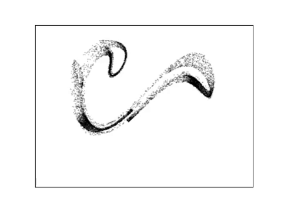
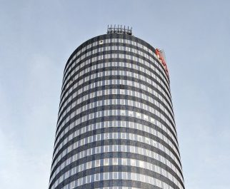
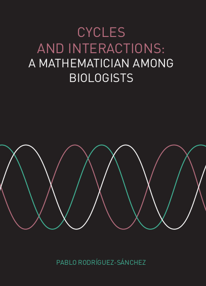
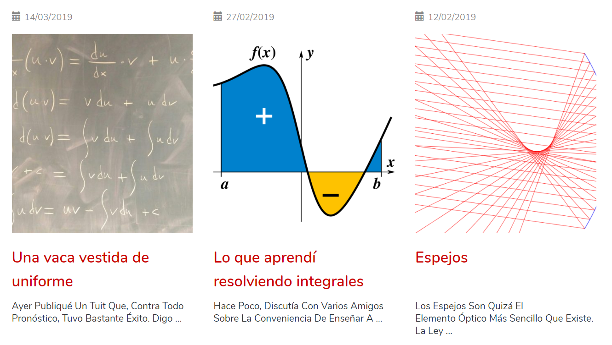
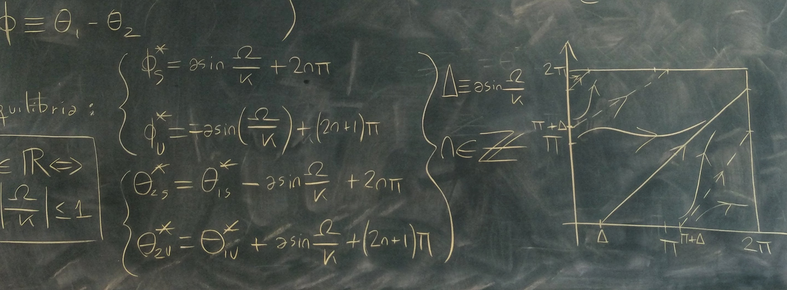
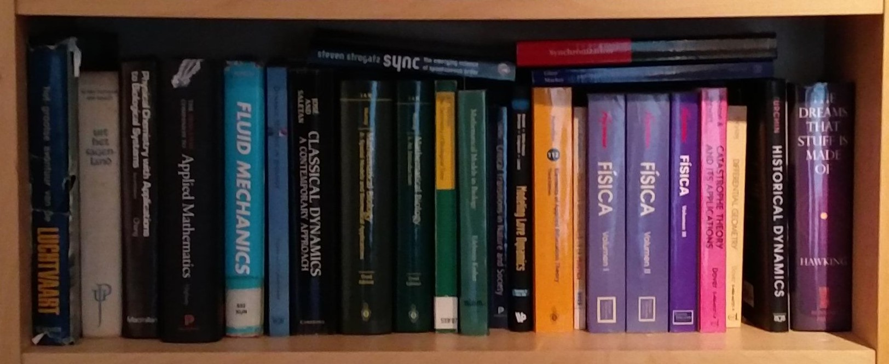

Title: Portfolio
Date: 5/29/2019, 10:23:47 AM
Modified: 5/29/2019, 10:23:52 AM
Category: Portfolio
Tags: portfolio
Slug: portfolio
Lang: en
Authors: Pablo Rodríguez-Sánchez
Summary: Some things I want to share

## Scientific programming

|                                                              [Pendulum][pendulum]                                                               |                                               [Dyntools][dyntools]                                               |
|:-----------------------------------------------------------------------------------------------------------------------------------------------:|:----------------------------------------------------------------------------------------------------------------:|
|                              _Python_ package for mechanical simulation of non-inertial simple and double pendula.                              |       _Python_ package for analysis and visualization of dynamical systems. It is still work in progress.        |
|                                            [][pendulum]                                            |                           [][dyntools]                            |
|                                                            [**Rolldown**][rolldown]                                                             |                                          [**Elevator tool**][elevator]                                           |
| _R_ package for computing potentials and pseudopotentials as described in my paper [Climbing Escher's ladder](https://arxiv.org/abs/1903.05615) | Jupyter Notebook showing how much can be done using the smartphone accelerometer inside a skyscrapper's elevator |
|                                            [][rolldown]                                            |                            [][elevator]                             |
|                                                           [**Cambio de hora**][time]                                                            |                                            [**Sleep models**][sleep]                                             |
|          _Shiny app_ showing the seasonal sunlight distribution in different Spanish locations, with and without daylight saving time           |                      _R package_ simulating classical mechanistic models of sleep dynamics                       |
|                                                  [][time]                                                  |                                  [][sleep]                                  |

Want to contribute? Follow me on [GitHub](https://github.com/PabRod)!

## PhD thesis

Available [here](https://doi.org/10.18174/520571).
## Talks
Since 2013, I give at least one popular science talk per year in a theater. Below I show those talks with English subtitles. For a full list, click [here](https://pabrod.github.io/pages/sci-comm-en.html#sci-comm).

|            [How to piss-off a mathematician][howtopiss]            |           [Random stuff about random numbers][random]           |
|:------------------------------------------------------------------:|:---------------------------------------------------------------:|
|                         Naukas Bilbao 2017                         |                       Naukas Bilbao 2015                        |
| [][howtopiss] | [][random] |

## Blog
Since 2011 I write for [Naukas.com](https://naukas.com), the largest science communication web-magazine in Spanish language. My blog, [_Fuga de cerebros_](https://fuga.naukas.com) (Brain drain), focuses in physics, mathematics, computational science, and the experience of emigrated scientists. For a full list of my texts (some of them in English), click [here](https://pabrod.github.io/pages/sci-comm-en.html#sci-comm).

## Teaching applets
Click [here](https://fuga.naukas.com/categoria/ciencia-interactiva/) to access my applets collection.

[howtopiss]:https://www.youtube.com/watch?v=RbXoYtQq3aY&yt%3Acc=on
[random]:https://www.youtube.com/watch?v=6koBb_wKofw&yt%3Acc=on
[pendulum]:https://github.com/PabRod/pendulum
[dyntools]:https://github.com/PabRod/phdtools
[rolldown]:https://github.com/PabRod/rolldown
[elevator]:https://github.com/PabRod/elevator-tool
[time]:https://github.com/PabRod/cambio-de-hora
[sleep]:https://github.com/PabRod/sleepR

## Scientific publications
Click here [here](https://pabrod.github.io/pages/publications-en.html#publications) to access my publications list.

